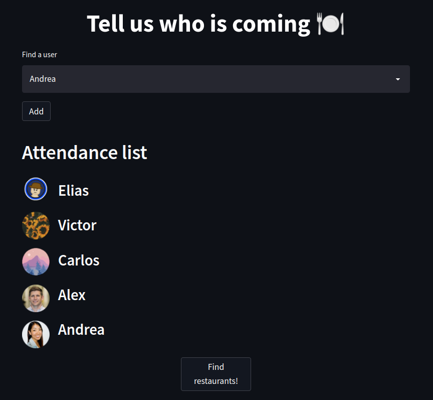
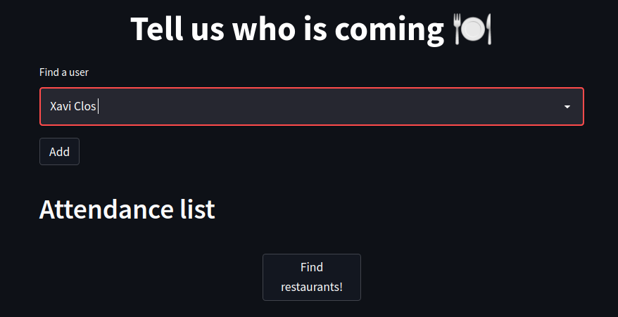
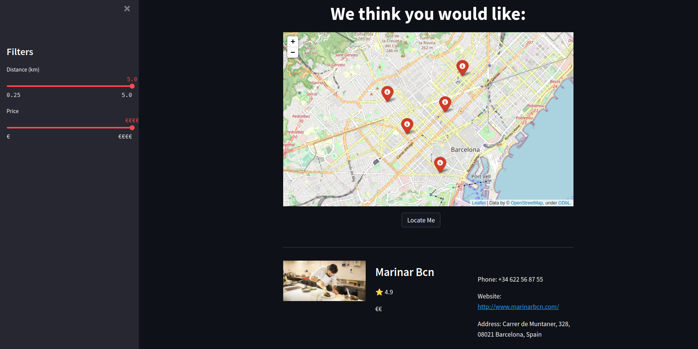

<div id="top"></div>

<!-- PROJECT LOGO -->
<br />
<div align="center">
  <a href="https://github.com/megaelius/Delfos-datathon-fme">
    
  </a>

<h3 align="center">Delfos' Restaurant Recommendation System for Groups</h3>

  <p align="center">
    Winning project of the  <a href=https://datathon.cat/>FME Datathon 2021</a> Reviews Challenge
    <br />
    <a href="https://github.com/megaelius/Delfos-datathon-fme"><strong>Explore the docs »</strong></a>
    <br />
    <br />
    <a href="https://github.com/megaelius/Delfos-datathon-fme">View Demo</a>
    ·
    <a href="https://github.com/megaelius/Delfos-datathon-fme/issues">Report Bug</a>
    ·
    <a href="https://github.com/megaelius/Delfos-datathon-fme/pulls">Request Feature</a>
  </p>
</div>


<!-- TABLE OF CONTENTS -->
<details>
  <summary>Table of Contents</summary>
  <ol>
    <li>
      <a href="#about-the-project">About The Project</a>
      <ul>
        <li><a href="#built-with">Built With</a></li>
      </ul>
    </li>
    <li>
      <a href="#getting-started">Getting Started</a>
      <ul>
        <li><a href="#installation">Installation</a></li>
      </ul>
    </li>
    <li><a href="#usage">Usage</a></li>
    <li><a href="#contributing">Contributing</a></li>
    <li><a href="#license">License</a></li>
    <li><a href="#contact">Contact</a></li>
    <li><a href="#acknowledgments">Acknowledgments</a></li>
  </ol>
</details>


<!-- ABOUT THE PROJECT -->
## About The Project

Finding restaurants that one may like is nowadays an easy task thanks to all the software tools we currently have. However such task becomes more difficult when instead of going by ourselves, we go to have dinner in a group. Everyone has different tastes, preferences, and budgets. Thus, it is not trivial how to combine them to select a restaurant that everybody will love.

To ease this task, we have developed a Restaurant Recommendation System that uses the restaurant prices, location, ratings, and reviews from both users and restaurants to find the perfect match for you and your companions.

This recommender can be used with the provided GUI, which allows to introduce the users, view and filter the restaurants intuitively and comfortably.

***DEVELOPMENT INFORMATION***

This project was developed between 13-14 November 2021 by the Delfos Team during the Datathon FME 2021, [taking first place in the Reviews challenge](https://fme.upc.edu/ca/noticies/cronica-de-la-1a-datathon-fme-2021). This challenge aimed to answer the following question:

  <p align="center"><i>WHAT RESTAURANTS IN BARCELONA WOULD YOU RECOMMEND TO SOMEONE?</i></p>

<div align="center">
    
  </div>


<p align="right">(<a href="#top">back to top</a>)</p>


### Built With

* [SentenceTransformers](https://www.sbert.net/)
* [Streamlit](https://streamlit.io/)
* [Python](https://www.python.org/)

<p align="right">(<a href="#top">back to top</a>)</p>


<!-- GETTING STARTED -->
## Getting Started

To get a local copy up and running you just need to follow these simple example steps!

### Installation

1. Clone the repo
   ```sh
   git clone https://github.com/megaelius/Delfos-datathon-fme.git
   ```
2. Install the necessary libraries and packages.
   ```sh
   pip3 install -r requirements.txt
   ```
<p align="right">(<a href="#top">back to top</a>)</p>


<!-- USAGE EXAMPLES -->
## Usage

To use the Delfos' Recommender GUI the following command needs to be executed:
   ```sh
   streamlit run app.py
   ```
Then, in the initial page of the app we can select which users are going to eat out:

<div align="center">
    
  </div>

Once all of them have been introduced, clicking in the *Find restaurants!* button. 
A newer page will pop up, showing the five restaurants that fit best the integrants of the groups according to their reviews.
If needed, using the slider on the left , results can be filtered by price and distance. 

<div align="center">
    
  <br>
  <br>
  </div>


In case you want to use the recommender from the terminal, this is possible by executing:
   ```sh
   python3 terminal.py
   ```

<p align="right">(<a href="#top">back to top</a>)</p>


<!-- CONTRIBUTING -->
## Contributing

Contributions are what make the open source community such an amazing place to learn, inspire, and create. Any contributions you make are **greatly appreciated**.

If you have a suggestion that would make this better, please fork the repo and create a pull request. You can also simply open an issue with the tag "enhancement".
Don't forget to give the project a star! Thanks again!

1. Fork the Project
2. Create your Feature Branch (`git checkout -b feature/AmazingFeature`)
3. Commit your Changes (`git commit -m 'Add some AmazingFeature'`)
4. Push to the Branch (`git push origin feature/AmazingFeature`)
5. Open a Pull Request

<p align="right">(<a href="#top">back to top</a>)</p>


<!-- LICENSE -->
## License

Distributed under the MIT License. See `LICENSE.txt` for more information.

<p align="right">(<a href="#top">back to top</a>)</p>


<!-- CONTACT -->
## Contact

* Elías Abad - [][git1] - elias.abad@estudiantat.upc.edu
* Alex Ferrando - [][git2] - alex.ferrando@estudiantat.upc.edu
* Carlos Hurtado - [][git3] - carlos.hurtado.comin@estudiantat.upc.edu
* Víctor Novelle - [][git4] - victor.novelle@estudiantat.upc.edu

<br>
<br>

Project Link: [https://github.com/megaelius/Delfos-datathon-fme](https://github.com/megaelius/Delfos-datathon-fme)

<p align="right">(<a href="#top">back to top</a>)</p>


<!-- ACKNOWLEDGMENTS -->
## Acknowledgments

* [Facultat de Matemàtiques i Estadística](https://fme.upc.edu/ca)
* [Universitat Politècnica de Catalunya - BarcelonaTech](https://www.upc.edu/ca)
* [Associació d'Estudiants de Dades](https://twitter.com/datastudents)

<div align="center">
    
  </div>

<p align="right">(<a href="#top">back to top</a>)</p>


<!-- MARKDOWN LINKS & IMAGES -->
<!-- https://www.markdownguide.org/basic-syntax/#reference-style-links -->
[git1]: https://github.com/megaelius/
[git2]: https://github.com/Naxel100
[git3]: https://github.com/CarlOwOs
[git4]: https://github.com/Vinomo4


