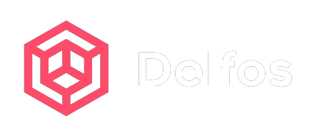

<div id="top"></div>

<!-- PROJECT LOGO -->
<br />
<div align="center">
  <a href="https://github.com/megaelius/Delfos-datathon-fme">
    
  </a>

<h3 align="center">Delfos' Restaurant Recommendation System for Groups</h3>

  <p align="center">
    Winning project of the  <a href=https://datathon.cat/>FME Datathon 2021</a> Reviews Challenge
    <br />
    <a href="https://github.com/megaelius/Delfos-datathon-fme"><strong>Explore the docs »</strong></a>
    <br />
    <br />
    <a href="https://github.com/megaelius/Delfos-datathon-fme">View Demo</a>
    ·
    <a href="https://github.com/megaelius/Delfos-datathon-fme/issues">Report Bug</a>
    ·
    <a href="https://github.com/megaelius/Delfos-datathon-fme/pulls">Request Feature</a>
  </p>
</div>


<!-- TABLE OF CONTENTS -->
<details>
  <summary>Table of Contents</summary>
  <ol>
    <li>
      <a href="#about-the-project">About The Project</a>
      <ul>
        <li><a href="#built-with">Built With</a></li>
      </ul>
    </li>
    <li>
      <a href="#getting-started">Getting Started</a>
      <ul>
        <li><a href="#prerequisites">Prerequisites</a></li>
        <li><a href="#installation">Installation</a></li>
      </ul>
    </li>
    <li><a href="#usage">Usage</a></li>
    <li><a href="#roadmap">Roadmap</a></li>
    <li><a href="#contributing">Contributing</a></li>
    <li><a href="#license">License</a></li>
    <li><a href="#contact">Contact</a></li>
    <li><a href="#acknowledgments">Acknowledgments</a></li>
  </ol>
</details>


<!-- ABOUT THE PROJECT -->
## About The Project

Finding restaurants that one may like it's nowadays an easy task thanks to all the software tools we currently have. However such task becomes more difficult when instead of going by ourselves, we go to have dinner in a group. Everyone has different tastes, preferences, and budgets. Thus, it is not trivial how to combine them to select a restaurant that everybody will love.

To ease this task, we have developed a Restaurant Recommendation System that uses the restaurant prices, location, ratings, and reviews from both users and restaurants to find the perfect match for you and your companions.

This recommender can be used with the provided GUI, which allows to introduce the users, view and filter the restaurants intuitively and comfortably.

***DEVELOPMENT INFORMATION***

This project was developed between 13-14 November 2021 by the Delfos Team during the Datathon FME 2021, [taking first place in the Reviews challenge](https://fme.upc.edu/ca/noticies/cronica-de-la-1a-datathon-fme-2021). This challenge aimed to answer the following question:

  <p align="center"><i>WHAT RESTAURANTS IN BARCELONA WOULD YOU RECOMMEND TO SOMEONE?</i></p>

[![Screen Shot][product-screenshot]](https://example.com)


<p align="right">(<a href="#top">back to top</a>)</p>


### Built With

* [Next.js](https://nextjs.org/)
* [React.js](https://reactjs.org/)
* [Vue.js](https://vuejs.org/)
* [Angular](https://angular.io/)
* [Svelte](https://svelte.dev/)
* [Laravel](https://laravel.com)
* [Bootstrap](https://getbootstrap.com)
* [JQuery](https://jquery.com)

<p align="right">(<a href="#top">back to top</a>)</p>


<!-- GETTING STARTED -->
## Getting Started

This is an example of how you may give instructions on setting up your project locally.
To get a local copy up and running follow these simple example steps.

### Prerequisites

This is an example of how to list things you need to use the software and how to install them.
* npm
  ```sh
  npm install npm@latest -g
  ```

### Installation

1. Get a free API Key at [https://example.com](https://example.com)
2. Clone the repo
   ```sh
   git clone https://github.com/megaelius/Delfos-datathon-fme.git
   ```
3. Install NPM packages
   ```sh
   npm install
   ```
4. Enter your API in `config.js`
   ```js
   const API_KEY = 'ENTER YOUR API';
   ```

<p align="right">(<a href="#top">back to top</a>)</p>


<!-- USAGE EXAMPLES -->
## Usage

Use this space to show useful examples of how a project can be used. Additional screenshots, code examples and demos work well in this space. You may also link to more resources.

_For more examples, please refer to the [Documentation](https://example.com)_

<p align="right">(<a href="#top">back to top</a>)</p>


<!-- ROADMAP -->
## Roadmap

- [] Feature 1
- [] Feature 2
- [] Feature 3
    - [] Nested Feature

See the [open issues](https://github.com/megaelius/Delfos-datathon-fme/issues) for a full list of proposed features (and known issues).

<p align="right">(<a href="#top">back to top</a>)</p>


<!-- CONTRIBUTING -->
## Contributing

Contributions are what make the open source community such an amazing place to learn, inspire, and create. Any contributions you make are **greatly appreciated**.

If you have a suggestion that would make this better, please fork the repo and create a pull request. You can also simply open an issue with the tag "enhancement".
Don't forget to give the project a star! Thanks again!

1. Fork the Project
2. Create your Feature Branch (`git checkout -b feature/AmazingFeature`)
3. Commit your Changes (`git commit -m 'Add some AmazingFeature'`)
4. Push to the Branch (`git push origin feature/AmazingFeature`)
5. Open a Pull Request

<p align="right">(<a href="#top">back to top</a>)</p>


<!-- LICENSE -->
## License

Distributed under the MIT License. See `LICENSE.txt` for more information.

<p align="right">(<a href="#top">back to top</a>)</p>


<!-- CONTACT -->
## Contact

Your Name - [@twitter_handle](https://twitter.com/twitter_handle) - email@email_client.com
Your Name - [@twitter_handle](https://twitter.com/twitter_handle) - email@email_client.com
Your Name - [@twitter_handle](https://twitter.com/twitter_handle) - email@email_client.com
Your Name - [@twitter_handle](https://twitter.com/twitter_handle) - email@email_client.com

Project Link: [https://github.com/megaelius/Delfos-datathon-fme](https://github.com/megaelius/Delfos-datathon-fme)

<p align="right">(<a href="#top">back to top</a>)</p>


<!-- ACKNOWLEDGMENTS -->
## Acknowledgments

* []()
* []()
* []()

<p align="right">(<a href="#top">back to top</a>)</p>


<!-- MARKDOWN LINKS & IMAGES -->
<!-- https://www.markdownguide.org/basic-syntax/#reference-style-links -->
[contributors-shield]: https://img.shields.io/github/contributors/megaelius/Delfos-datathon-fme.svg?style=for-the-badge
[contributors-url]: https://github.com/megaelius/Delfos-datathon-fme/graphs/contributors
[forks-shield]: https://img.shields.io/github/forks/megaelius/Delfos-datathon-fme.svg?style=for-the-badge
[forks-url]: https://github.com/megaelius/Delfos-datathon-fme/network/members
[stars-shield]: https://img.shields.io/github/stars/megaelius/Delfos-datathon-fme.svg?style=for-the-badge
[stars-url]: https://github.com/megaelius/Delfos-datathon-fme/stargazers
[issues-shield]: https://img.shields.io/github/issues/megaelius/Delfos-datathon-fme.svg?style=for-the-badge
[issues-url]: https://github.com/megaelius/Delfos-datathon-fme/issues
[license-shield]: https://img.shields.io/github/license/megaelius/Delfos-datathon-fme.svg?style=for-the-badge
[license-url]: https://github.com/megaelius/Delfos-datathon-fme/blob/master/LICENSE.txt
[linkedin-shield]: https://img.shields.io/badge/-LinkedIn-black.svg?style=for-the-badge&logo=linkedin&colorB=555
[linkedin-url]: https://linkedin.com/in/linkedin_username
[product-screenshot]: images/screenshot.png
